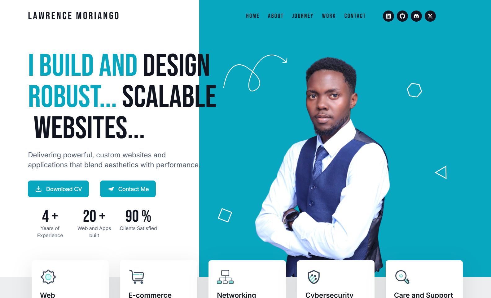

# My Portfolio

Welcome to my personal **developer portfolio**!
This project showcases my skills, projects, and experience as a **Software Developer & Network Engineer**.

<!-- |  |
|:--:|
| Portfolio Preview | -->

---

## Table of Contents

- [About](#about)
- [Features](#features)
- [Tech Stack](#tech-stack)
- [Getting Started](#getting-started)
- [Project Structure](#project-structure)
- [Deployment](#deployment)
- [Contact](#contact)

---

## About

This portfolio is designed to **showcase my work, technical expertise, and professional background**.
It includes **project showcases, a resume section, interactive animations, and contact details**.
💡 The goal is to create an engaging, responsive, and modern portfolio that reflects my passion for technology and innovation.

---

## Features

- **Responsive design** for all devices
- **Project gallery** with descriptions and links
- **About** and **skills** sections
- **Preview** and **Downloadable Resume**
- **Fast performance** powered by Next.js & Vercel
- **Animations & Transitions** using Framer Motion

---

## Tech Stack

     

- **Frontend:** [React](https://react.dev/) / [Next.js](https://nextjs.org/)
- **Styling:** [Tailwind CSS](https://tailwindcss.com/) / CSS Modules + Framer Motion animations
- **Deployment:** [Vercel](https://vercel.com/) / [Netlify](https://www.netlify.com/) / GitHub Pages (optional)

### Tools

    

---

## Getting Started

1. **Clone the repository:**

    ```bash
    git clone https://github.com/your-username/lawrence-portfolio.git
    cd lawrence-portfolio
    ```

2. **Install dependencies:**

    ```bash
    npm install
    # or
    yarn install
    ```

3. **Run the development server:**

    ```bash
    npm run dev
    # or
    yarn dev
    ```

4. Open [http://localhost:3000](http://localhost:3000) to view it in your browser.

---

## Project Structure

```bash
lawrence-portfolio/
├── public/           # Static assets
├── src/              # Source code
│   ├── components/   # Reusable components
│   ├── pages/        # Next.js component pages
│   ├── styles/       # Global and component styles
│   └── data/         # Project and skills data
├── package.json
└── README.md
```

---

## Deployment

This portfolio can be easily deployed using platforms like **Vercel, Netlify,** or **GitHub Pages**. Push your changes to the main branch and connect your repository to your preferred platform.

Example:

```bash
# For Vercel
npm run build
vercel --prod

```

---

## Contact

Feel free to reach out via the contact form on the site or at:

- **Email:** [lawrencemoriango@gmail.com](mailto:lawrencemoriango@gmail.com).
- **Portfolio Site:** your-portfolio-link.com
- **LinkedIn:** [linkedin.com/in/lawrence-moriango](https://www.linkedin.com/in/lawrence-moriango)
- **GitHub:** [github.com/your-username](https://github.com/L-moriango)

---
⭐ If you like this portfolio, don’t forget to star the repo! ⭐

**Thank you for visiting my portfolio!**
